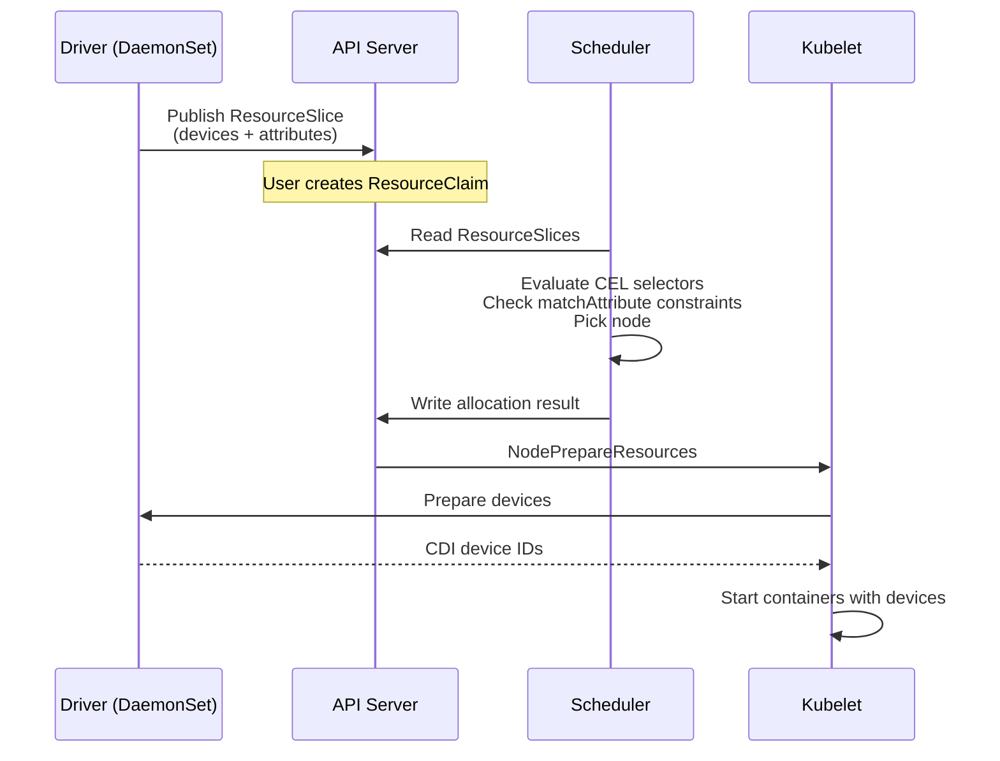

# DRA Primer

Dynamic Resource Allocation (DRA) is a Kubernetes API — `resource.k8s.io/v1`, GA since Kubernetes 1.34 — that lets workloads describe what kind of device they need, not just how many.

## The Problem DRA Solves

Kubernetes was designed around interchangeable resources: CPU cores and memory bytes. Every gigabyte of RAM is the same as every other gigabyte. The scheduler treats them as simple numbers.

Specialized hardware doesn't fit this model. GPUs have different models, memory capacities, and firmware versions. Two GPUs might both be "GPUs," but one has 80 GB of HBM while the other has 16 GB. They might sit on different PCIe root complexes or in different NUMA zones. These differences matter for performance.

The older device plugin API treats devices as opaque counts (`nvidia.com/gpu: 2`). You can't filter by attributes, express topology constraints, or distinguish one device from another. DRA replaces this with attribute-rich device descriptions and CEL-based matching.

## Four Objects You Need to Know

### ResourceSlice

A DRA driver on each node discovers local devices and publishes them with typed attributes. ResourceSlices are the driver's inventory list — cluster-scoped, read-only from the workload's perspective.

```yaml
apiVersion: resource.k8s.io/v1
kind: ResourceSlice
metadata:
  name: node1-gpu-nvidia-0
driverName: gpu.nvidia.com
nodeName: node1
devices:
  - name: gpu-0
    basic:
      attributes:
        gpu.nvidia.com:
          model:
            string: H100
          memory:
            int: 80
        resource.kubernetes.io:
          pcieRoot:
            string: "0000:00:00.0"
```

Attributes live under domain namespaces. The `resource.kubernetes.io` domain holds topology attributes shared across drivers — this is how cross-driver coordination works without drivers knowing about each other.

### DeviceClass

A cluster-scoped object naming a category of devices. Points to a driver, can carry default selectors.

```yaml
apiVersion: resource.k8s.io/v1
kind: DeviceClass
metadata:
  name: gpu.nvidia.com
spec:
  selectors:
    - cel:
        expression: device.driver == "gpu.nvidia.com"
```

### ResourceClaim

A workload's request for devices. Lives in a namespace, referenced by pods. Contains device requests with CEL selectors that filter candidates.

```yaml
apiVersion: resource.k8s.io/v1
kind: ResourceClaim
metadata:
  name: gpu-claim
  namespace: default
spec:
  devices:
    requests:
      - name: gpu
        exactly:
          deviceClassName: gpu.nvidia.com
          count: 1
          selectors:
            - cel:
                expression: >-
                  device.attributes["gpu.nvidia.com"].memory >= 80
```

### ResourceClaimTemplate

Creates a new ResourceClaim for each pod that references it. When each pod needs its own devices (the common case), use a template. The system creates and garbage-collects claims automatically.

## CEL Selectors and matchAttribute

CEL expressions filter devices by their attributes:

```cel
device.attributes["gpu.nvidia.com"].memory >= 80
device.attributes["dra.net"].rdma == true
device.attributes["dra.net"].ipv4.startsWith("10.0.")
```

The `matchAttribute` constraint enforces relationships between devices in the same claim. It requires two devices to share the same value for a named attribute:

```yaml
spec:
  devices:
    requests:
      - name: gpu
        exactly:
          deviceClassName: gpu.nvidia.com
          count: 1
      - name: nic
        exactly:
          deviceClassName: dranet
          count: 1
    constraints:
      - requests: ["gpu", "nic"]
        matchAttribute: resource.kubernetes.io/pcieRoot
```

This tells the scheduler: find a GPU and a NIC that both have the same `pcieRoot` value — ensuring they're on the same PCIe root complex.

## The Allocation Lifecycle

1. **Driver publishes** — DaemonSet discovers local devices, writes ResourceSlice objects with typed attributes.
2. **User claims** — Pod references a ResourceClaim (or template) specifying device class, count, selectors, and constraints.
3. **Scheduler evaluates** — Reads ResourceSlices, evaluates CEL selectors against each candidate device, checks `matchAttribute` constraints, picks a node.
4. **Scheduler writes allocation** — Updates `status.allocation` on the ResourceClaim with the specific devices and node.
5. **Kubelet prepares** — Calls the driver's `NodePrepareResources` gRPC method. The driver sets up the device and returns CDI device references. Containers start with device access.



---

**Next:** [02-the-composition-gap.md](02-the-composition-gap.md) — why DRA alone isn't enough

**Previous:** [00-start-here.md](00-start-here.md) — orientation and glossary
