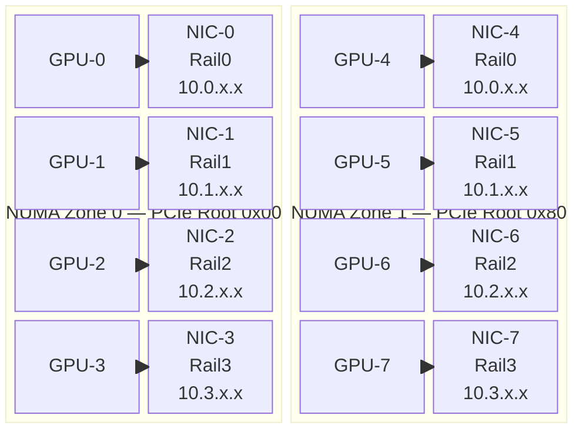

# The Composition Gap

You now know what DRA is and how it works. This document explains the specific problem the composite driver solves — and why DRA alone can't solve it.

## GPU-NIC Pairing Matters

GPU-accelerated inference workloads (like llm-d) use RDMA to transfer data between nodes. Each GPU communicates through a dedicated NIC. For maximum throughput, the GPU and its NIC must share the same PCIe root complex — otherwise traffic crosses slower inter-socket links.

The performance difference is significant: mismatched GPU-NIC pairs can lose up to **60% of available bandwidth**. On an 8-GPU node with 4 NICs per NUMA zone, the topology looks like this:

## Node Topology



> **Drivers:** GPU → `gpu.nvidia.com` · NIC → `dra.net`
> **Pairing:** `matchAttribute` on `resource.kubernetes.io/pcieRoot`
> **Request sizes:** 2-pair → one NUMA zone · 4-pair → fill one zone · 8-pair → entire node

Each GPU has exactly one adjacent NIC. They share a PCIe root. The NIC is connected to a specific rail subnet. Getting this pairing right is essential for RDMA performance.

## What DRA Can Do

DRA has the building blocks for topology pairing. Both drivers publish `pcieRoot` under the shared `resource.kubernetes.io` domain. A claim can use `matchAttribute` to enforce co-location:

```yaml
spec:
  devices:
    requests:
      - name: gpu
        exactly:
          deviceClassName: gpu.nvidia.com
          count: 1
      - name: nic
        exactly:
          deviceClassName: dranet
          count: 1
          selectors:
            - cel:
                expression: device.attributes["dra.net"].rdma == true
    constraints:
      - requests: ["gpu", "nic"]
        matchAttribute: resource.kubernetes.io/pcieRoot
```

This works for a single GPU-NIC pair. The scheduler finds a GPU and NIC with the same `pcieRoot` value on the same node.

## What DRA Cannot Do

Three gaps prevent DRA from handling real multi-pair workloads:

**1. No atomic cross-driver composition.** Each driver publishes its own ResourceSlices independently. The scheduler can allocate a GPU from one driver and a NIC from another, but these are two independent scheduling decisions. If the NIC allocation fails after the GPU is allocated, there's no automatic rollback. The composite driver solves this by presenting pre-validated pairs as single allocatable units — one allocation decision, atomic.

**2. RoCE config chicken-and-egg.** RDMA NICs need per-rail routing configuration (gateway, routing table index, network CIDR). This config is opaque device parameters that must be set at claim creation time. But you don't know which NIC (and therefore which rail) you'll get until allocation time. The composite driver solves this with Go template substitution in opaque params — configuration is rendered at Prepare time when the specific NIC is known.

**3. Claim proliferation.** Requesting 8 GPU-NIC pairs using native DRA requires 16 device requests and 8 `matchAttribute` constraints. Users must hand-write 60+ lines of YAML for a common workload pattern. The composite driver reduces this to:

```yaml
resources:
  requests:
    composite.dra.io/gpu-nic-pair: "8"
```

## KEPs to Know

Two upstream Kubernetes enhancements are relevant but don't close these gaps:

**KEP-5732 (Topology-Aware Scheduling)** adds device packing policies to the scheduler. Currently alpha in K8s 1.36, with DRA integration deferred to 1.37+ beta. This would reduce fragmentation but does not address cross-driver composition or opaque param injection. [Upstream issue](https://github.com/kubernetes/enhancements/issues/5732).

**KEP-5729** confirmed that per-replica unique claims are out of scope. Workloads using LWS/StatefulSet get identical claim templates per replica. The composite driver's 500ms synthesizer cycle mitigates this in practice by rapidly updating available pairs. [Upstream issue](https://github.com/kubernetes/enhancements/issues/5729).

---

**Next:** [03-how-it-works.md](03-how-it-works.md) — how the composite driver solves this

**Previous:** [01-dra-primer.md](01-dra-primer.md) — DRA fundamentals
