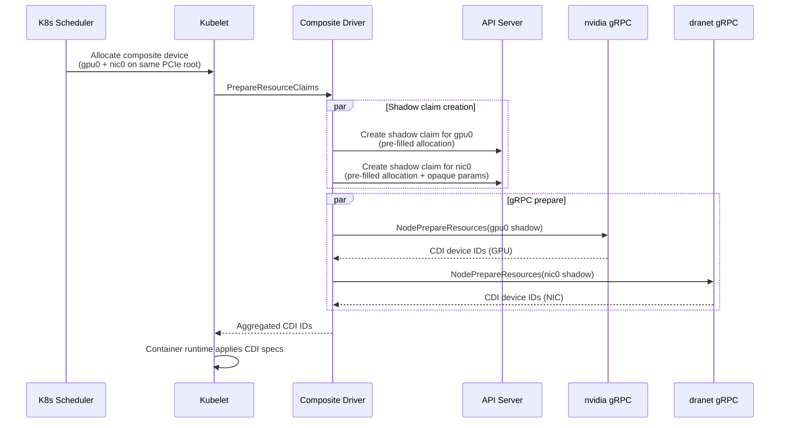

# Shadow Claims

Shadow claims are the core mechanism of the composite driver. Every contributor needs to understand this pattern deeply.

## What Is a Shadow Claim

A shadow claim is a real Kubernetes ResourceClaim created by the composite driver — not by a user, not by the scheduler. It has pre-filled allocation status pointing to a specific underlying device. Its only purpose is to delegate hardware preparation to the underlying driver via that driver's existing gRPC socket.

The composite driver is a **pure orchestrator**. It contains zero nvidia or dranet code. Shadow claims let it reuse the real drivers without reimplementation.

## Why Real Claims Are Required

The underlying drivers don't accept bare gRPC calls. Their `kubeletplugin.Helper` fetches the ResourceClaim from the API server by namespace/name/UID before passing it to the driver's Prepare handler. If the claim doesn't exist, the lookup fails. Shadow claims must be real K8s objects.

For more on why gRPC passthrough without real claims was rejected, see [RFC.md § 3A](../RFC.md#a-grpc-passthrough-without-real-claims).

## What the Underlying Driver Validates

kubeletplugin.Helper performs three checks before forwarding a Prepare request to the driver:

| Check | What it validates | How shadow claims satisfy it |
|-------|-------------------|------------------------------|
| **Exists** | Claim exists in API server by namespace + name | Shadow claims are created via the Kubernetes API before Prepare |
| **Allocated** | `status.allocation` is non-nil | The composite driver pre-fills allocation with the specific pool + device |
| **UID match** | Request UID matches the stored claim UID | The composite driver reads the UID after creation and passes it in the gRPC request |

## What Is NOT Checked

This is the key insight that makes the pattern work:

- **ReservedFor** — not validated by the underlying driver's Helper
- **`pod.spec.resourceClaims`** — neither nvidia nor dranet checks whether the claim is listed in the pod spec
- **Who set the allocation** — no provenance check on who wrote `status.allocation` (scheduler vs. composite driver)
- **Allocation source** — no validation that the allocation came from the scheduler's decision

These are implicit assumptions in the current DRA implementation, not API contracts. They have been validated against real nvidia GPU driver and dranet codepaths. Full validation trace in [ARCHITECTURE.md § 4.2](../ARCHITECTURE.md#42-shadow-claim-lifecycle).

## Lifecycle



Both phases (shadow creation and gRPC prepare) fan out in parallel using goroutines. If any step fails, all already-created shadows are cleaned up before returning the error.

For the complete lifecycle flowchart with all edge cases, see [ARCHITECTURE.md § 4.2](../ARCHITECTURE.md#42-shadow-claim-lifecycle).

## Cleanup and Crash Recovery

Three layers prevent shadow claim leaks:

1. **Normal path:** `UnprepareResourceClaims` calls each underlying driver's gRPC Unprepare, then deletes the shadow claims.

2. **Crash recovery:** BoltDB persists shadow records. On restart, the driver reloads records and can unprepare/delete shadows for claims it was managing before the crash.

3. **Orphan reconciler:** A 5-minute ticker scans for shadow claims (by label) whose composite claim owner no longer exists. OwnerReferences also provide Kubernetes-native garbage collection as a backstop.

For the full set of failure scenarios (driver crash, node down, control-plane down, stale ResourceSlices), see [HA-DESIGN.md](../HA-DESIGN.md).

## Risks

The shadow claims pattern is novel — no upstream DRA driver uses it. Two medium risks are worth knowing:

1. **Pre-filled allocation provenance.** The composite driver writes `status.allocation` instead of the scheduler. No upstream validation exists today, but this is not an API guarantee. If Kubernetes adds provenance checks, shadow claims would need adaptation.

2. **Virtual ResourceSlices.** The composite driver publishes ResourceSlices for devices it doesn't physically manage. The scheduler treats slices at face value — no provenance validation exists.

Both risks are documented with mitigations in [RFC.md § 5](../RFC.md#5-risks--mitigations).

## Exercise 2: Request Pairs and Inspect Shadow Claims

**Time:** ~10 minutes
**Requires:** Exercise 1 complete (composite driver deployed)

**Step 1:** Create a pod requesting 2 GPU-NIC pairs.

```yaml
apiVersion: v1
kind: Pod
metadata:
  name: test-pair
spec:
  containers:
  - name: test
    image: registry.k8s.io/pause:3.9
    resources:
      requests:
        composite.dra.io/gpu-nic-pair: "2"
      limits:
        composite.dra.io/gpu-nic-pair: "2"
```

Apply it: `kubectl apply -f test-pair.yaml`

**Step 2:** List all ResourceClaims.

```bash
kubectl get resourceclaims -n default
```

You should see:
- The composite claim (created by the webhook from your pod's resource request)
- Shadow claims (created by the composite driver during Prepare)

**Step 3:** Examine a shadow claim.

```bash
kubectl get resourceclaim <shadow-claim-name> -o yaml
```

Look for:
- **`metadata.ownerReferences`** — points to the composite claim
- **`metadata.labels`** — `app.kubernetes.io/managed-by` and `composite-claim-uid`
- **`status.allocation`** — pre-filled with specific pool, device, and driver name
- **`spec.devices.requests`** — exactly 1 device request for the underlying DeviceClass

**Step 4:** Clean up and verify garbage collection.

```bash
kubectl delete pod test-pair
kubectl get resourceclaims -n default
```

Shadow claims should be gone — cleaned up by the composite driver's Unprepare and/or by Kubernetes OwnerReference cascade.

<details>
<summary>Expected output (if you don't have cluster access)</summary>

```
# Step 2 output
NAME                                           DRIVER                     STATE
composite-test-pair-gpu-nic-pair              composite.dra.llm-d.io     allocated
shadow-a1b2c3-nvidia-gpu0                     gpu.nvidia.com             allocated
shadow-a1b2c3-nic-nic0                        dra.net                    allocated
shadow-d4e5f6-nvidia-gpu1                     gpu.nvidia.com             allocated
shadow-d4e5f6-nic-nic1                        dra.net                    allocated

# Step 3: shadow claim has ownerReference to composite claim,
# status.allocation.devices.results[0] points to specific pool/device,
# labels include managed-by and composite-claim-uid

# Step 4: all claims deleted after pod deletion
```

</details>

---

**Next:** [05-code-walkthrough.md](05-code-walkthrough.md) — source code orientation

**Previous:** [03-how-it-works.md](03-how-it-works.md) — architecture overview
